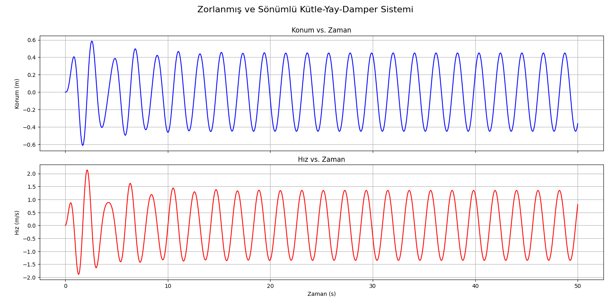
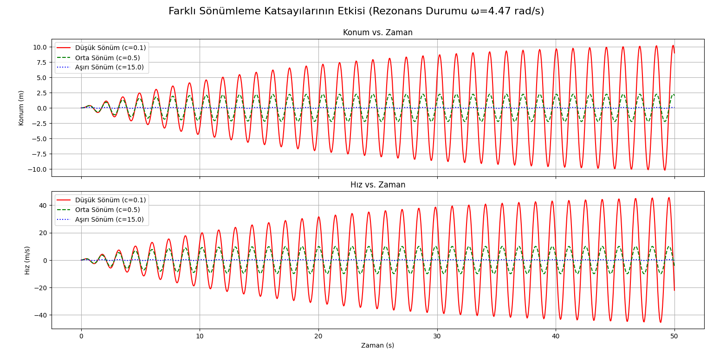

# Analysis of Resonance, Damping, and Stability in Dynamic Systems

  

This repository provides a Python-based simulation to analyze the fundamental principles of dynamic systems, using a forced, damped mass-spring-damper as a case study. The project aims to visualize the significant impact of **resonance** and the critical role of **damping** in ensuring system stability.

The analysis is conducted using `SciPy` for numerical integration and `Matplotlib` for visualization.

---

## 📝 Publication

The findings and implications of this research have been compiled into a formal academic paper. You can read more about our approach and discoveries here:

**[The Effect of Resonance and Damping on Dynamic System Stability: A Numerical Approach](http://uc4n.com/blog/the-effect-of-resonance-and-damping-on-dynamic-system-stability-a-numerical-approach)**
---

## 🚀 About The Project

This project investigates the behavior of a dynamic system governed by a second-order linear ordinary differential equation:

$$m \frac{d^2x}{dt^2} + c \frac{dx}{dt} + kx = F_0 \sin(\omega t)$$

The primary goal is to answer the following questions through simulation:
* How does a system behave when the external forcing frequency approaches its natural frequency? (Resonance)
* How does the damping coefficient control the system's response during resonance and ensure overall stability?
* How can these fundamental physics principles be applied to practical engineering problems, such as suspension design, structural analysis, and vibration control?

---

## 🛠️ Getting Started

To run the simulations on your local machine, please follow these steps.

1.  **Clone the repository:**
    ```sh
    git clone [https://github.com/U-C4N/resonance-damping-stability.git](https://github.com/U-C4N/resonance-damping-stability.git)
    cd resonance-damping-stability
    ```
2.  **Install the required libraries:**
    ```sh
    pip install numpy scipy matplotlib
    ```
3.  **Run the simulations:**
    * To simulate the single resonance case:
        ```sh
        python single_case_simulation.py
        ```
    * To run the comparative analysis of different damping coefficients:
        ```sh
        python comparative_damping_analysis.py
        ```

---

## 📊 Results and Analysis

The simulations clearly demonstrate the effects of resonance and damping on system stability.

### The Impact of Resonance

When the forcing frequency is tuned to the system's natural frequency ($\omega_n \approx 4.47$ rad/s), the oscillation amplitude shows a dramatic **~10-fold increase** compared to the non-resonant reference case. This highlights the potentially destructive power of resonance.

<br>


*Figure 1: Position and velocity response of the system in a state of resonance.*

<br>

### The Controlling Role of Damping

By testing different damping coefficients during resonance, it becomes evident that damping is the key to maintaining stability. Low damping leads to uncontrolled, growing oscillations, whereas high damping effectively suppresses the resonance effect entirely.

<br>


*Figure 2: A comparative analysis of three different damping coefficients during resonance.*

<br>

### 🔍 Frequency-Domain Validation

The analytical magnification–factor curve and five *time-domain* sample
points align almost perfectly, confirming that the closed-form solution
matches the numerical ODE results.


*Figure&nbsp;3. Analytical frequency-response curve (solid) vs. time-domain
simulation points (markers) for four damping levels.*

<br>

The quality factor, \\(Q = 1/(2\\zeta)\\), follows the expected
inverse-proportional law with damping:


*Figure&nbsp;4. Log–log plot of quality factor versus damping coefficient.*


These results confirm that damping parameters must be carefully optimized in engineering design to ensure system reliability and safety.

---

## 💡 Advanced Applications & Future Vision

The fundamental insights from this project serve as a stepping stone for numerous advanced technologies and future research directions.

* **Active and Semi-Active Control Systems:** Instead of a fixed damping coefficient (`c`), one can design "smart" systems using Magnetorheological (MR) dampers. These systems can change their damping properties in milliseconds in response to sensor data. This simulation provides a perfect test-bed for developing the control algorithms for such adaptive suspension systems in vehicles or civil structures.

* **Structural Health Monitoring & Digital Twins:** This simulation model can form the core of a **Digital Twin** for a real-world physical asset (e.g., a bridge, an aircraft wing, or a vehicle). By feeding real-time sensor data from the physical asset into the model, we can compare the predicted behavior with the actual behavior. Any deviation can signify material fatigue or component failure (e.g., a degrading shock absorber), enabling predictive maintenance before a catastrophic failure occurs.

* **Vibrational Energy Harvesting:** Damping inherently dissipates energy as heat. Future systems could use regenerative dampers that convert this unwanted vibrational energy into usable electrical power. This model can be used to estimate the amount of harvestable energy under different operating conditions, paving the way for self-powered sensors and electronics in vibrating environments.

* **Optimal Control with Machine Learning:** The simulation environment is an ideal training ground for a **Reinforcement Learning (RL)** agent. The AI agent could learn, through millions of virtual trials, a control policy that is far more effective than traditional controllers, finding non-obvious strategies to minimize vibration, energy consumption, and structural stress simultaneously.

---

## 📜 License

This project is licensed under the MIT License. See the `LICENSE` file for more details.
